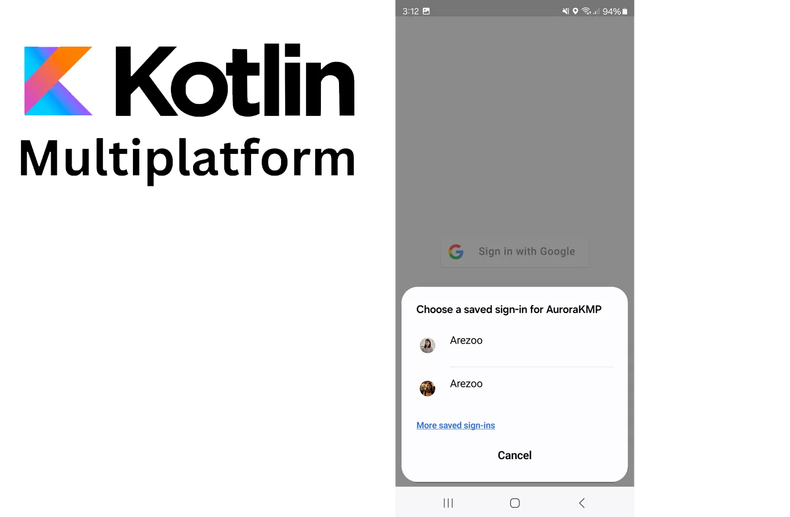

# Google sign in with Kotlin multiplatform
In this project, we will implement Google Sign-In for both Android and iOS using Kotlin Multiplatform (KMP). Instead of using Firebase for token verification, we will demonstrate how to verify the token with your own backend however, our focus will be on the client side.
You can find the step by step implementation in this [article](https://medium.com/@arezoo.nazerdeylami/implementing-google-sign-in-with-kotlin-and-compose-multiplatform-8fad1898b866).

